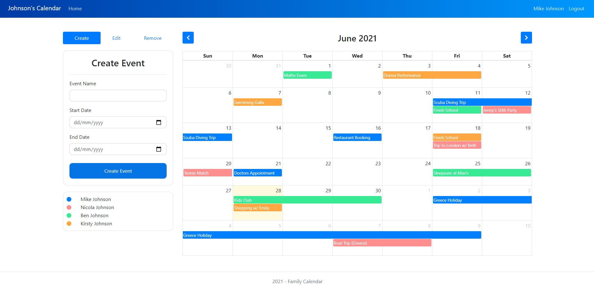

# Family Calendar

This web-based calendar system allows users to create their own calendars, or alternatively join existing calendars created by other users using a calendar ID. It makes the app ideal for families (hence the name) and utilises the FullCalendar JS package for a clean layout of each users events. 

The app backend utilsies PHP to communicate with MySQL database, which together manages and stores the users, calendars and events created. The front-end utilises a combination of custom CSS and bootstrap, alongside JS for active-features, managing events and calendar customisations.

At some point I plan to expand this project to support daily schedules and harness the extensive features FullCalendar provides for easier management of events. However the current application has fulfilled all my initial requirements and provided a suitable central platform for family and friends to coordinate activities. 

Try Family Calendar yourself: [http://familycalendar.epizy.com](http://familycalendar.epizy.com)

